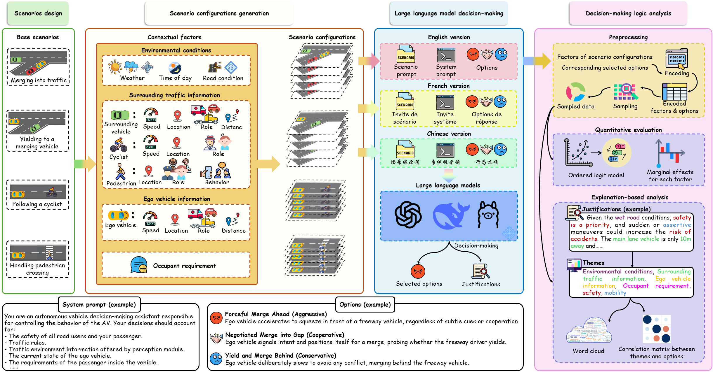

<div align="center">

# Probing Large Language Models for Autonomous Driving Behavior

**Zhipeng Bao · Wenjie Zhao · Qianwen Li**<br/>
University of Georgia, Athens, GA, USA

*Journal of Intelligent and Connected Vehicles* (JICV)

[](requirements.txt)
[](LICENSE)
[](#how-to-run)
<br/>


[Overview](#overview) •
[Study design](#study-design) •
[Quick start](#quick-start) •
[How to run](#how-to-run) •
[Repository layout](#repository-layout) •
[Supplementary material](#supplementary-material)

</div>

---

## Overview

LLMs are increasingly considered as high-level decision modules for autonomous vehicles, which makes it important to
understand not only *whether* they complete a driving task but *how* they decide. This repository is the replication
package of the paper. It probes the prompt-conditioned high-level action choices of three widely used LLMs in four
everyday driving scenarios, each with 1,500 contextual variants presented in three languages. The models choose among
behavioural options ordered by aggressiveness; an **ordered logit model** quantifies how the contextual factors shift
those choices, and a **thematic analysis** of the models' justifications reveals the reasoning behind them.

<p align="center">
  
</p>
<p align="center"><sub><b>Fig. 1.</b> Pipeline for probing prompt-conditioned LLM action preferences and decision rationales.</sub></p>

### Key findings

| | |
| :---: | --- |
| 🧠 | **The model matters.** GPT-4o is more conservative, while DeepSeek-V3 and Llama 3.1 act more assertively, especially when interacting with other vehicles. |
| 🌐 | **The prompt language matters.** Chinese and French prompts are associated with more assertive choices than English prompts, with French the strongest. |
| 🚸 | **The context matters.** All models shift toward more protective behaviour when vulnerable road users (cyclists, pedestrians) appear, and remain sensitive to occupant urgency, traffic complexity and road-user type. |

> [!NOTE]
> The study characterises textual decision tendencies under controlled prompts. It does not validate LLMs for direct
> vehicle control or any safety-critical actuation.

## Study design

<table>
  <tr>
    <td align="center" width="20%"><h3>3</h3>LLMs</td>
    <td align="center" width="20%"><h3>4</h3>driving scenarios</td>
    <td align="center" width="20%"><h3>3</h3>prompt languages</td>
    <td align="center" width="20%"><h3>1,500</h3>cases per scenario</td>
    <td align="center" width="20%"><h3>54,000</h3>LLM queries</td>
  </tr>
</table>

### Models

| Model | Access | Model ID | Reply format |
| --- | --- | --- | --- |
| GPT-4o | OpenAI Batch API | `gpt-4o-2024-11-20` | two labelled plain-text lines |
| DeepSeek-V3 | `api.deepseek.com` | `deepseek-chat` | JSON object |
| Llama 3.1-405B | Lambda Inference API (`api.lambda.ai/v1`) | `llama3.1-405b` | JSON object |

Every case is an independent, single-turn query at temperature 1.0. Apart from the reply-format block, the prompts are
identical across the three models.

### Scenarios

| | Scenario | Factor combinations | Behavioural options, from aggressive to conservative | In the paper | Prompts |
| :---: | --- | ---: | --- | --- | --- |
| **S1** | Merging into freeway | 233,280 | Assertive Merge → Cooperative Merge (act first) → Cooperative Merge (observe first) → Cautious Merge | §3.2 · Table 2 · Figs. 2–3 | [EN](prompts/merging_en.txt) · [ZH](prompts/merging_cn.txt) · [FR](prompts/merging_fr.txt) |
| **S2** | Yielding to a merging vehicle | 209,952 | Assertive Interaction → Cooperative Interaction (act first) → Cooperative Interaction (observe first) → Cautious Interaction | §3.3 · Table 3 · Figs. 4–5 | [EN](prompts/mainstream_en.txt) · [ZH](prompts/mainstream_cn.txt) · [FR](prompts/mainstream_fr.txt) |
| **S3** | Following a cyclist | 20,736 | Honk or Signal and Pass → Assertive Pass with Minimum Distance → Cautious Pass with Wide Margin → Follow Patiently | §3.4 · Table 4 · Figs. 6, 7a | [EN](prompts/bicycle_en.txt) · [ZH](prompts/bicycle_cn.txt) · [FR](prompts/bicycle_fr.txt) |
| **S4** | Handling pedestrian crossing | 19,440 | Maintain Speed with Alertness → Slow Down and Monitor → Yield Preemptively | §3.5 · Fig. 7b | [EN](prompts/pedestrian_en.txt) · [ZH](prompts/pedestrian_cn.txt) · [FR](prompts/pedestrian_fr.txt) |

The contextual factors (weather, time of day, road surface, surrounding traffic, ego-vehicle state and occupant urgency)
are listed in Table 1 of the paper. Choices are coded 1 = aggressive, 2 = neutral and 3 = conservative; in S1–S3 the
last two options are both coded as conservative. For estimation, the 1,500 cases of a scenario are split into nine
subsets of about 167 cases, one per model × language combination.

## Quick start

```bash
git clone https://github.com/hzxbzp/Probing-LLMs-Autonomous-Driving.git
cd Probing-LLMs-Autonomous-Driving
pip install -r requirements.txt        # Python >= 3.10, CPU only
cp config.example.yaml config.yaml     # step 2 only: add your OpenAI, DeepSeek and Lambda API keys
```

`config.yaml` is git-ignored, so your keys stay on your machine. Every script locates the repository root from its own
location, so the commands below work from any working directory.

## How to run

Run the steps in order. Placeholders: `<scenario>` is `S1_merging_into_freeway`, `S2_yielding_to_merging_vehicle`,
`S3_following_a_cyclist` or `S4_handling_pedestrian_crossing`; `<lang>` is `en`, `cn` or `fr`; `<model>` is `gpt4o`,
`deepseek` or `llama`.

```bash
# 1. Scenario generation → data/1_scenario_configurations/  (optional: the output is already included)
python code/1_scenario_generation/<scenario>/generate_scenarios_en.py
python code/1_scenario_generation/<scenario>/generate_scenarios_cn.py
python code/1_scenario_generation/<scenario>/generate_scenarios_fr.py
python code/1_scenario_generation/<scenario>/sample_1500_cases.py

# 2. LLM queries → data/2_llm_responses/  (needs the API keys in config.yaml)
python code/2_llm_queries/gpt4o/<scenario>/<lang>/submit_batch.py              # prints a batch id
python code/2_llm_queries/gpt4o/<scenario>/<lang>/collect_results.py <batch_id>
python code/2_llm_queries/deepseek_v3/<scenario>/<lang>/run_deepseek_v3.py
python code/2_llm_queries/llama31_405b/<scenario>/<lang>/run_llama31_405b.py

# 3. Encoding → data/3_encoded_datasets/
python code/3_encoding/encode_<scenario>.py

# 4. Ordered logit models → results/
python code/4_ordered_logit/olm_<scenario>.py                                  # S1, S2 and S3
python code/4_ordered_logit/S4_handling_pedestrian_crossing_option_counts.py   # S4

# 5. Thematic analysis → results/
python code/5_thematic_analysis/word_cloud_S1_merging_into_freeway.py <model>
python code/5_thematic_analysis/theme_heatmap_S1_merging_into_freeway.py <model>
python code/5_thematic_analysis/word_cloud_S2_yielding_to_merging_vehicle.py <model>
python code/5_thematic_analysis/theme_heatmap_S2_yielding_to_merging_vehicle.py <model>
python code/5_thematic_analysis/sankey_S3_following_a_cyclist.py
python code/5_thematic_analysis/radar_S4_handling_pedestrian_crossing.py
```

The raw LLM responses are not included in the repository, so step 2 has to be run before steps 3 to 5.

## Repository layout

```text
.
├── code/
│   ├── 1_scenario_generation/    factorial design and 1,500-case sampling, per scenario and language
│   ├── 2_llm_queries/            query scripts and prompt modules: <model>/<scenario>/<lang>/
│   ├── 3_encoding/               estimation datasets (nine model × language subsets)
│   ├── 4_ordered_logit/          ordered logit models and average marginal effects
│   └── 5_thematic_analysis/      word clouds, theme heat maps, Sankey diagram, radar chart
├── data/
│   └── 1_scenario_configurations/<scenario>/
│       ├── all_scenarios_{en,cn,fr}.csv    full factorial design
│       └── sample_1500_{en,cn,fr}.csv      the 1,500 cases used in the experiment
├── prompts/                      human-readable prompt set, 4 scenarios × 3 languages
├── Replication Explanatory File for Journal-Associated Data.docx
├── config.example.yaml           API-key template for step 2
├── pipeline.png                  Fig. 1
└── requirements.txt
```

`data/2_llm_responses/`, `data/3_encoded_datasets/` and `results/` are created when the pipeline is run.

## Supplementary material

| File | Contents |
| --- | --- |
| [`Replication Explanatory File…`](Replication%20Explanatory%20File%20for%20Journal-Associated%20Data.docx) | Journal replication form: data, code, software and experiment-design description |
| [`prompts/`](prompts/) | Full prompt set: system prompt, behavioural options and an example context block for every scenario × language |

## License

Released under the [MIT License](LICENSE) © 2025 Zhipeng Bao, Wenjie Zhao, Qianwen Li.
